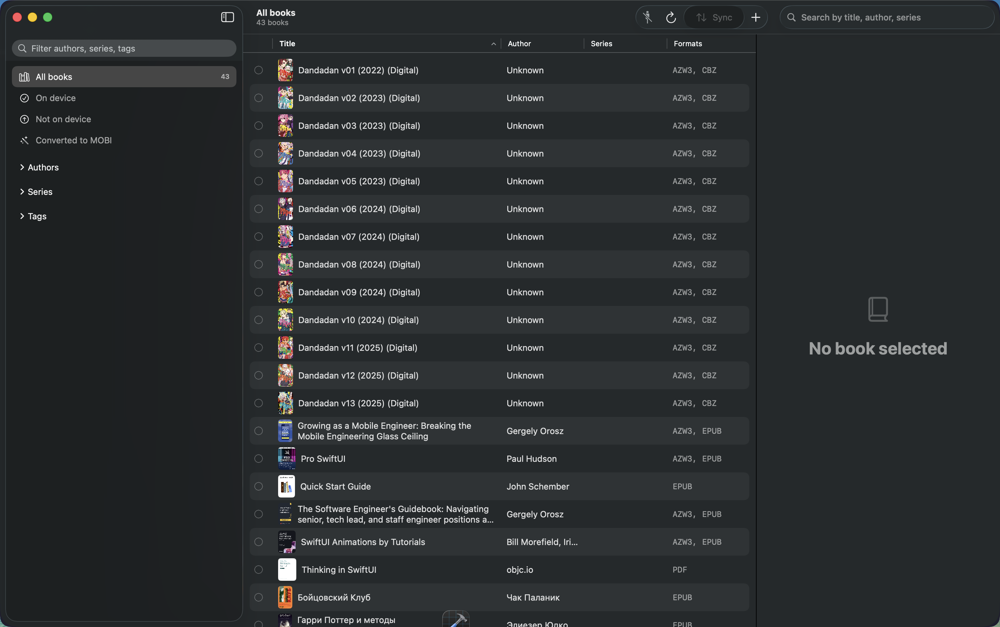
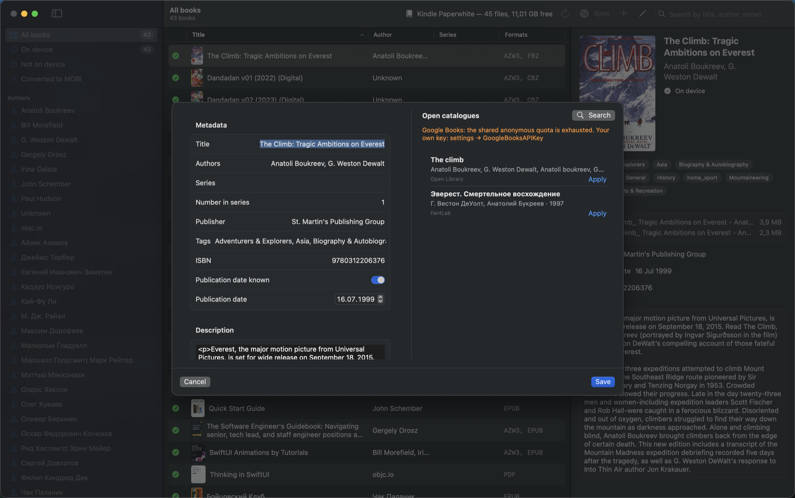
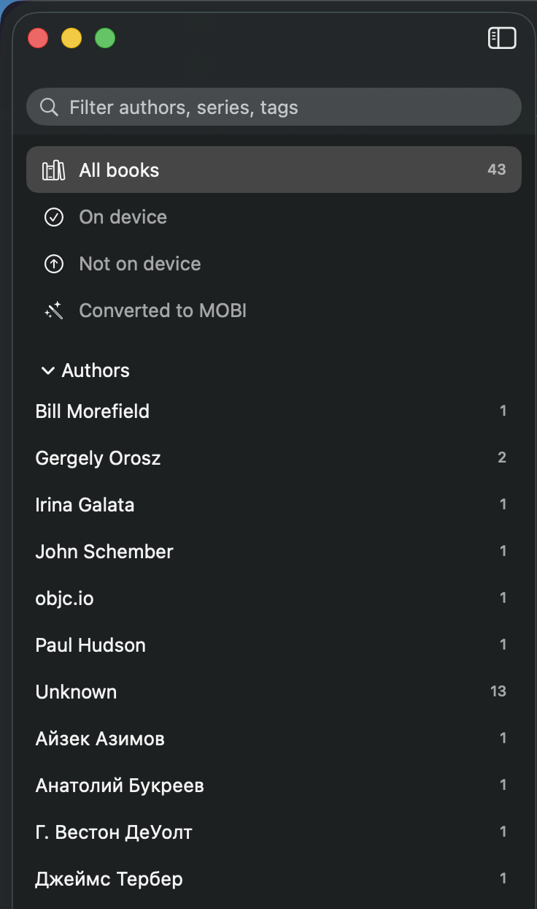
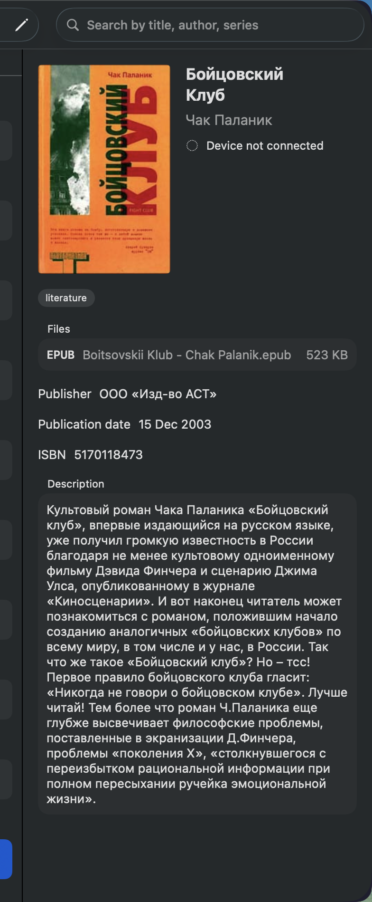
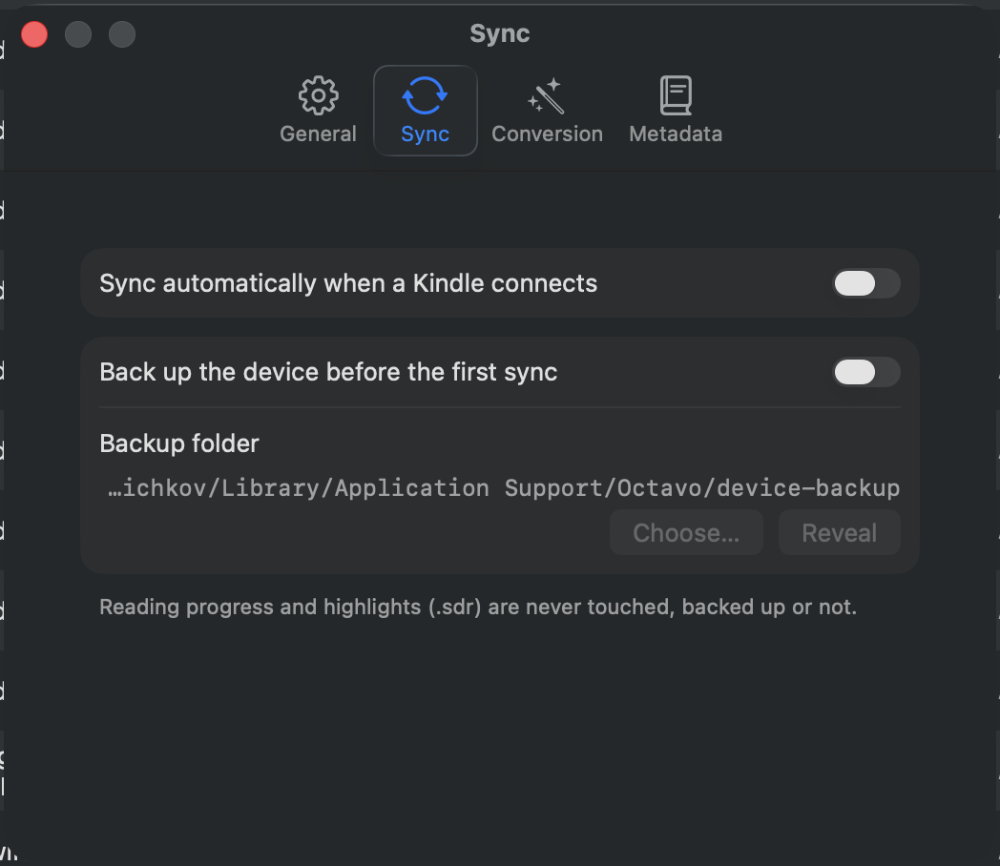

<div align="center">


# Octavo

**A native macOS app that syncs your ebook library to a Kindle and edits its metadata.**
A 4 MB replacement for the 1 GB calibre, working on the very same library.

[](https://github.com/artemnovichkov/Octavo/actions/workflows/ci.yml)
[](https://github.com/artemnovichkov/Octavo/releases/latest)
[](https://www.apple.com/macos/)
[](https://swift.org)
[](LICENSE)

</div>



Octavo works **in place on your existing calibre library** at `~/Calibre Library` — the same
`metadata.db`, the same folder layout. Nothing to migrate, and calibre keeps working alongside it.

calibre itself is not required. If there is no library, Octavo offers to create one, and the result
is a calibre library proper — same schema, `user_version=26` — so calibre opens it later without a
migration.

## Screenshots

Metadata editor with live catalogue search:



| Authors/series/tags with counts | Book details | Settings ▸ Sync |
|---|---|---|
|  |  |  |

## What it does

- **Syncs to the Kindle over MTP** — no cloud, no email-to-Kindle, no Amazon account. Plug the
  cable in and Octavo notices; a diff against the device says what is missing.
- **Converts what the Kindle cannot read** — EPUB, CBZ and FB2 become AZW3 (or MOBI 6, if you
  prefer) on the way out, with the result cached.
- **Edits metadata in calibre's own schema** — title, authors, series, publisher, tags, ISBN,
  publication date, description, cover.
- **Looks metadata up online** — Open Library, FantLab (which is what makes a Cyrillic library
  searchable) and Google Books.
- **Imports books** — drag files in or press `+`. EPUB, AZW3, AZW, MOBI, PRC, PDF, CBZ, FB2, TXT.
  Metadata comes out of the file itself: the OPF inside an EPUB, the EXTH header of an AZW3/MOBI,
  `title-info` in FB2, document attributes in a PDF, the first page of a CBZ as the cover.
- **Never touches your reading progress** — `.sdr` folders, annotations and highlights are off
  limits by design, not by convention.
- **Browses by author, series and tag** — the sidebar tallies counts per facet and has its own
  filter field, on top of the four smart filters (all/on device/not on device/converted).
- **Has a Settings window** — auto-sync on connect, back up the device before the first sync,
  prune the conversion cache after each sync, ask (or not) before removing books, pick which
  metadata catalogues to search, remember the last filter across launches.
- **Remembers recent libraries** — File ▸ Open Recent, and a full menu bar (Library/Device menus,
  keyboard shortcuts for every filter, Find, Back Up Device…).

## Install

Download the latest `Octavo-<version>-macos-arm64.zip` from
[Releases](https://github.com/artemnovichkov/Octavo/releases/latest), unzip it, then **remove the
quarantine flag** before moving the app into `/Applications`:

```sh
xattr -dr com.apple.quarantine ~/Downloads/Octavo.app
```

The app is signed ad-hoc and not notarized — a Developer ID certificate costs $99 a year, and this
is a hobby project — so Gatekeeper refuses it on first launch until the flag is gone. Note that
`Control-click ▸ Open` no longer works as an override on macOS 15 and later; the only GUI route is
to attempt a launch, dismiss the warning, and press **Open Anyway** in
*System Settings ▸ Privacy & Security*.

If you instead see *"Octavo is damaged and can't be opened"*, that is a broken signature rather than
quarantine — please [open an issue](https://github.com/artemnovichkov/Octavo/issues).

Requires macOS 26 or later on Apple Silicon.

## Tech stack

No external dependencies at all — SwiftPM resolves nothing, everything comes from the SDK.

| Module | Built on |
|---|---|
| `MTPKit` | PTP/MTP written directly on **IOUSBHost**: transport, container codec, session, operations. Hotplug through `IOServiceAddMatchingNotification` as an `AsyncStream`. |
| `CalibreLibrary` | **SQLite3** from the SDK. calibre's schema triggers call Python functions, so `title_sort()` and `uuid4()` are re-registered via `sqlite3_create_function`. |
| `KindleFormat` | Own zip reader on **zlib**, metadata parsers for EPUB/MOBI/FB2/PDF/CBZ, and AZW3/KF8 + MOBI 6 writers whose header offsets, index layouts and PalmDoc coding were recovered by scanning reference files. |
| `MetadataFetch` | `URLSession` against Open Library, FantLab and Google Books. |
| `SyncEngine` | Library↔device diff, on-device manifest, conversion cache, transfer. |
| `Octavo` | **SwiftUI** app: `@MainActor @Observable` model over a `DeviceController` actor. |

Swift 6 language mode with strict concurrency, Swift Testing, SwiftPM, macOS 26+, Apple Silicon.
Dependencies run one way: `Octavo → SyncEngine → {MTPKit, CalibreLibrary, KindleFormat}`.

## Build from source

```sh
swift build                                   # libraries and CLIs
swift test                                    # the suite; the catalogue tests are skipped
OCTAVO_NETWORK_TESTS=1 swift test             # include the tests that hit the live catalogues
./Scripts/make-app.sh                         # build/Octavo.app, ad-hoc signed
open build/Octavo.app
```

## CLI

```sh
.build/debug/mtpprobe                    # USB descriptors, MTP session, device contents — read-only
.build/debug/mtpprobe --ls system        # list a folder
.build/debug/mtpprobe --cat system/version.txt
.build/debug/mtpprobe --push file        # write a single file into documents/
.build/debug/mtpprobe --rm name          # delete a single file from documents/
.build/debug/octavo-sync                 # dry run: what a sync would do, writes nothing
.build/debug/octavo-sync --apply         # real sync (pulls a documents/ backup first)
.build/debug/octavo-sync --library PATH  # a library other than the resolved one
.build/debug/octavo-sync --format mobi   # override the app's Conversion setting for one run
.build/debug/octavo-convert book.epub    # conversion alone
.build/debug/octavo-convert book.epub --format mobi
```

The MTP interface is claimed exclusively: while Octavo.app is running every CLI fails with *"The MTP
interface is busy in another process"*, and vice versa. `pkill -x Octavo` first.

## How syncing works

State lives on the device in `documents/.octavo.json`, keyed by the calibre book uuid. Renaming a
book in the library therefore does not produce a duplicate, and reinstalling the app loses nothing.
On first run Octavo adopts calibre's own `metadata.calibre` from the storage root, so books already
on the device are not re-uploaded.

A book counts as stale when the device file differs from what the manifest recorded, when the
library file changed size, or when its metadata was edited after it was sent. Comparing the device
file size against the library file directly does not work — calibre rewrites EXTH metadata during
transfer, so its copies are a few bytes larger than the original.

## Safety boundaries

- Writes go **only** under `documents/`. The storage root is left alone: a `*.bin` there is what the
  Kindle treats as a firmware update.
- `.sdr` folders — reading progress, annotations, highlights — are never deleted. Orphan detection
  skips folders entirely, and removing a book is only ever an explicit user action.
- `octavo-sync --apply` pulls all of `documents/` into
  `~/Library/Application Support/Octavo/device-backup` before its first write, and `metadata.db` is
  copied before the first edit.

## Conversion

The Kindle opens neither EPUB nor CBZ nor FB2, so those are converted before sending. Two targets,
switchable in Settings ▸ Conversion (and with `--format` on either CLI):

- **AZW3 (KF8)**, the default. Keeps the book's stylesheets as separate flows, keeps the spine
  split into documents, and carries a real NCX index — so a converted EPUB arrives styled, with a
  table of contents the Kindle's own button can use, and with working internal links.
- **MOBI 6**, the fallback. One flat HTML stream plus image records, no index structures at all.
  It loses every stylesheet, but it is the simplest thing the firmware will open, which makes it
  worth keeping while AZW3 output is still being checked against the device.

Neither target is guesswork: the header offsets, the four INDX/TAGX/CNCX index layouts, the
skeleton/chunk arrangement and the PalmDoc coding were all recovered by decoding the AZW3 files
calibre produced for this same library. The test suite parses all 30 of them before it is allowed
to parse anything Octavo wrote.

Three header fields cost real debugging time, and all three are documented in the writers: the DRM
offset/count at `0x98`/`0x9C`, where being four bytes off makes the Kindle report *"Unable to open
item"*; the NCX index at `0xE4`, which must be `0xFFFFFFFF` when absent because `0` points at the
header record itself; and the extra-record-data flags in the low half of `0xE0`, which have to
agree exactly with the trailers each text record actually carries. Text records are always 4096
uncompressed bytes; shortening them to land on character boundaries silently breaks every index
in the file, and only shows up on a book that is not pure ASCII.

Results are cached in `~/Library/Caches/Octavo/converted`, keyed by source size and mtime, so
editing a book invalidates its own cache entry. The target format is the file extension, so the two
do not collide and switching back and forth does not throw the cache away.

## Metadata sources

Open Library covers Latin script, FantLab covers Russian fiction, and Google Books covers everything
else — though its anonymous quota is shared and usually exhausted. Your own key:

```sh
defaults write org.octavo.Octavo GoogleBooksAPIKey YOUR_KEY
```

Which library is open is remembered under `LibraryRoot` in the same `org.octavo.Octavo` defaults
suite, so the CLIs and the app always agree on it.

## Not implemented yet

- Embedded fonts from EPUB — dropped rather than carried as KF8 resources; the Kindle substitutes.
- A nested table of contents. The NCX index is written flat, at one level.
- `filepos` internal links in MOBI 6 output. AZW3 gets `kindle:pos:` links; MOBI 6 does not.
- `.apnx` page numbers.

Implementation notes, hard-won constraints and the reasoning behind the architecture live in
[CLAUDE.md](CLAUDE.md).

## License

[MIT](LICENSE) © Artem Novichkov
